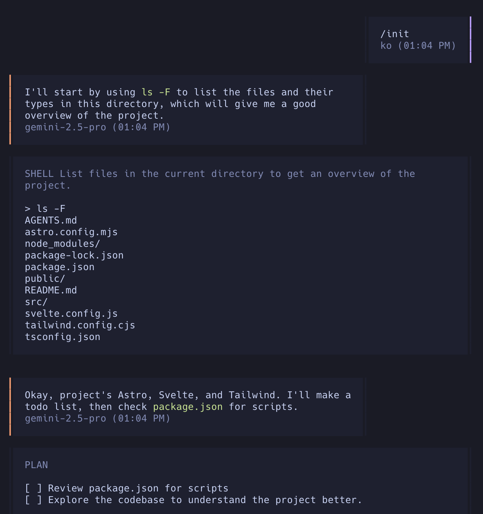

Weekend experiments with AI agentic coding using [opencode.ai](https://opencode.ai/) and [Zed](https://zed.dev/agentic).

Why opencode when [Claude Code](https://docs.anthropic.com/en/docs/claude-code/overview) is the current talk of the town? Code uses up credits fast, and I don't have a [claude subscription](https://www.anthropic.com/pricing), and opencode is opensource and looks promising. There is also [goose](https://block.github.io/goose/) which looks promising.

Opencode.ai is [sparsely documented](https://opencode.ai/docs/), so I'm using [Claude Code's docs](https://docs.anthropic.com/en/docs/claude-code/overview) and their [best practices for agentic coding guide](https://www.anthropic.com/engineering/claude-code-best-practices), as well as [simon's coding-agents posts](https://simonwillison.net/tags/coding-agents/).

## Why AI Agents or humans will do anything to avoid copy pasting

The dinosaur way of AI coding, eons ago back in the early days of 2025, practically lost to human memory, involved copy pasting code into chat interfaces, then copy pasting it back into an IDE and running it to see if it worked... then often back again to the chat!

As AI kept proving its worth, coders discovered that AI needs more context - so now ppl were copy pasting even more! File upon file, so many files that things were getting pasted back into the wrong files after all the changes and over time the chat would entropy into context rot. This was not the promised land - even though humans were increasingly relieved of their coding work, they were getting overwhelmed with all the copy pasting.

And thus was born the agentic coding agent which use looked at your files and did things - first by asking, like with [aider](https://github.com/Aider-AI/aider) but increasingly even guru level coders are full YOLO (with some [caveats](https://simonwillison.net/2025/Mar/19/vibe-coding/)) like [Armin on agentic coding](https://lucumr.pocoo.org/2025/6/12/agentic-coding/):

> My general workflow involves assigning a job to an agent (which effectively has full permissions) and then waiting for it to complete the task. I rarely interrupt it, unless it's a small task. Consequently, the role of the IDE — and the role of AI in the IDE — is greatly diminished; I mostly use it for final edits. This approach has even revived my usage of Vim, which lacks AI integration.

However, these guys have code running through their veins! So this blog post is a more basic human stab at understanding how to use agentic coding in a way which still leaves my codebase understandable to me.

The key thing is you run the tool inside a codebase - ideally a git repo (or just a folder) and the agent will smartly do the tasks you set for it inside a `AGENTS.md` file.

## Rules or CLAUDE.md

This file can have many names, from Claude.md to `AGENTS.md` or [.rules](https://zed.dev/docs/ai/rules), . The consensus amoung the many Agentic coding tools is that we will have a global rules file, then for the overall project folder and in any subfolder as we see fit. The AI agent will figure out which rules files to pull into the context.

gives an AI agent two things:

**Project overview** - now of course the AI can figure this out from the code base, but this is how the human stays in the loop and has some control - what the code does and what the human intends can often diverge

**The work**: Clear steps on what the AI agent should do. My current understanding is that this is closer to being a recipe - a detailed task list, rather than a vague do something wish.

[Anthropic says](https://www.anthropic.com/engineering/claude-code-best-practices) to keep this concise and human-readable and to keep refining it over time. Don't add to much content, iterate on things and periodically run it through a [prompt improver](https://docs.anthropic.com/en/docs/build-with-claude/prompt-engineering/prompt-improver).

The nature of AI models is that they are able to figure out what you mean long as there is enough info to figure it out - the below is the basic things I'm putting in for now:

### A possble CLAUDE.md

**Project Overview**
- What the codebase does
- Tech stack and key decisions
- File structure and conventions

**Current Tasks**
- Specific, actionable items
- Clear success criteria
- Boundaries and constraints - for bigger projects include tests.

**AI Agent Guidelines**
- How do we want it to code e.g don't add new packages, follow exisiting folder structure

**AI Notes & Learnings**
- Lessons learned about the codebase
- Common pitfalls to avoid
- Helpful context for future tasks

**Changelog**
- Concise summary of work done


## Using Agentic coding (Opencode)

I started by asking the AI agent itself to make a plan before telling it what to do, I didn't have a `AGENTS.md` setup - all current AI agents need guidelines to follow else they just vibe away.
Starting opencode and running `/init` gets the AI to look over your repo and write its own `CLAUDE.md file` - so right from the start its a potential circular loop of AI agents telling themselves what to do!



And away it goes! I found it useful to refer to files e.g saying

```
pls improve /src/content.config.ts to use the new Astro content collection best practices

take a look at https://docs.astro.build/en/guides/content-collections/#defining-collections then lets discuss
```

And opencode used a web tool to fetch the docs and figured out the right thing to do.

Using an AI agent is easy to understand when testing it with small tasks that are well understood and have clear documentation. For my simple task, I didn't need an AI agent. I could have just copied and pasted, but this already saved me a lot of time compared to copy-pasting.

I tested some bigger tasks, and Open Code rearranged my entire repository, which I ended up nuking as I want this here blog site understandable and hackable by me! However, with a well-crafted agents.md file, a clear to-do list, a testing setup, and tools setup for the agent to use like the browser to test its changes, I can see how my task here is more PM and "smelling" the code for stinks rather than writing code itself.

OpenCode struggled with human-in-the-loop control - it would execute 12 tasks when I wanted 4, with no clear way to pause for approval. The solution is better `CLAUDE.md` instructions: skip minor details, but ask about architectural changes, new packages, or significant functionality changes. I still want to understand the code and keep it human-readable.

This workflow has two likely futures: either architects build scaffolding to orchestrate agent teams, or we skip code entirely and just ask AI to create complete applications. Eventually, AI will write the blog posts too - just like most humans stopped reading books and switch to tiktoks/youtubes, many of us will stop writing and emote to an AI which will get our point across.

### Task Lists

I am struggling to understand how best to manage the task list.  We need a clear list of tasks. Once those tasks are completed, I can:

1. Nuke the old task list, add a new one
2. Keep growing the list of task and mark them done
3. Add a Changelong or Completed section at the bottom or in a seperate file called `CHANGELOG.md`.

I'm leaning towards using both 1 and 3, though option 2 is also sound.

### Opencode usage notes

- The input window is tiny and its designed for basic inputs - so anything long has to go into a text file which u feed to the AI as needed - or it will automagically read that context when it will be useful.
- Sessions are really useful - give them clear names, but you can't - the AI names them automagically.
- How do I put myself in the open code flow? I don't see an easy way to add fences for the AI agent to stop at. Specify in agents.md?
	- Basic things like exploration, thinking, reading files happen automatically without asking me.
	- For major changes summarize them and ask the user.
	- I can see how this would really slow down the proper vibe coding.

### Human in the loop or lack of

I struggled a bit with this - I wanted to see and approve the changes, but there wasn't a clear way to do this - till it dawned on my its text all the way down. I just tell the AI agent to plan and get a ok from me, than go ahead and execute, but keep asking me about any major changes.

Which leads to...

### Vibe Coding!

Its too easy to vibe code - give the AI a feature and IT WILL implement it but sometimes it takes basic simple code into some godawful kitchen sink of patterns[^1].

<blockquote class="twitter-tweet"><p lang="en" dir="ltr">There&#39;s a new kind of coding I call &quot;vibe coding&quot;, where you fully give in to the vibes, embrace exponentials, and forget that the code even exists. It&#39;s possible because the LLMs (e.g. Cursor Composer w Sonnet) are getting too good. Also I just talk to Composer with SuperWhisper…</p>&mdash; Andrej Karpathy (@karpathy) <a href="https://twitter.com/karpathy/status/1886192184808149383?ref_src=twsrc%5Etfw">February 2, 2025</a></blockquote> <script async src="https://platform.twitter.com/widgets.js" charset="utf-8"></script>

What is quite impressive is that to properly Vibe code, the only way to do it is to speak to the AI. I am using a random Whisper dictation tool to do that. I assume, though I don't know if OpenAI has one built in, that this is almost like magic. You talk to the AI, and it does the task.

Of course, there are [pitfalls](https://twitter.com/mitsuhiko/status/1935643789109895272) like Claude just making up bad code, but unlike real life you can always go back to your last save or commit.

> When Claude is done with a multi stage task it writes a summary. Often completely made up. Even when it gave up it will happily talk about its accomplishments.

Personally, I'm falling on the side of slow+thoughtful organic friendly vibe coding:

> So for now I think there's a big skill point that is still only achieved by humans -- guiding the LLM to produce systems that both the human and the LLM will be good at long term. That is, NOT vibe coding from the beginning, but doing something a bit slower than vibe coding and much faster than bespoke coding, with an eye toward clean, testable, isolated systems - something the LLM is not naturally any good at making but can be done with good guidance. [#](https://news.ycombinator.com/item?id=44351335)


## MCP's aka tools

As I used opencode - it became obvious that outside of the limited tools available on my machine it needs more - which leads us to [MCP's](https://modelcontextprotocol.io/introduction), or as Armin put it - tools.

> - **Anything can be a tool**. A shell script can be a tool, an MCP server can be a tool, a log file can be a tool. If the agent can interact or observe it, it counts.

AI agents need to interact with the broader world to be effective. Almost every digital service in the world has an API though which you can drive the tool, however every API is bespoke and different and often the docs don't make sense and are incomplete or out of date.

This is where Anthropic's MCP protocol came in - they said screw all your guys, just give us simple well documented tools we can call, we don't want to use your many API's (even though Claude can read api docs and make its own api using tool, but across a billion API's that is just crazy!)

> Expose data and content from your servers to LLMs

My real life brain wave came when Sonnet 4 and Gemini 2.5 pro was stuggling to implement a basic [shadcn-svelte](https://shadcn-svelte.com/) component - the models must have read the [shadcn](https://ui.shadcn.com/) react docs. As I reached for the correct [shadcn docs](https://shadcn-svelte.com/docs) to copy paste them to the agent - it finally dawned on me why I need MCP's enabled.

> Context7 MCP pulls up-to-date, version-specific documentation and code examples straight from the source — and places them directly into your prompt.

I added the [context7 remote MCP](https://context7.com/) and told the agent to "use context7". And lo and behold it automatically did so and finally fixed my busted component!

The most impressive part of using MCP's is that its a one off understanding and setup - then it becomes very easy to use them everywhere.

## takeaways, hopefully valid for at least a few months

**Agentic coding is a huge, gamechanging upgrade** from just using regular chat interfaces for coding. This was actually hard to reazlize, as intuitively its the same model powering both things, so I should be able to get great output from regular old shat.

**Skilled ppl who understand the domain and the tech stack will be in high demand.**  Understanding the system and building the scaffolding around it is going to become a even more important skill than it currently is. These ppl are already in high demand, but small numbers[^2] of them will become 10-100x engineers as they manage a horde of AI agents, and more importantly, understand what is going on.

**Observability and state management** is difficult even with a small project - humans can't keep up with the speed of the AI agent checking in code. A real codebase will have with multiple subagents working! We need dashboards and some kind of logic to orchestrate everything. I do expect that very soon the AI will build a custom dashboard based on the work[^3].

**The tools aren't good enough yet** and we have to beg in enlight to do a,b,c and only spawn so many subagents vs really we need a way to hardcode a bunch of guardrails, like the number of parallel agents and what they can work on etc.

**Logging was always super important** for humans to understand what was going on as they coded a feature, and it remains true for the current crop of AI agents.

How long will this current state where humans are empowered by AI agentic coding last? The obvious next state is where you don't need humans at all in the coding loop, but the final takeaway is that we still have a while to go. Really i see coding splitting into two groups:

- Vibe apps and systems - for a lot of ppl and small business, a vibe coded app with a few basic human checks is good enough.
- Real systems - these will continue to require human guidance, with a whole new job of managing AI agents and keeping track of how things are going using science fiction interfaces.

[^1]: Armin builds a sentry clone by [vibe coding using Claude Code with sub agents](https://youtu.be/oodxg0qatX0?si=OfchM_R_qVGU8lkh). It doesn't work, but its mind boggling how [easy it was to to kick off](https://github.com/mitsuhiko/vibe-minisentry/issues/1) - if you squint your brain properly you can see the future AI swarms emerging out of the primordial ooze of github.

    His [sloppy xml parser](https://lucumr.pocoo.org/2025/6/21/my-first-ai-library/) does work and even got a 👍🏽 from no less than [Simon](https://simonwillison.net/2025/Jun/21/my-first-open-source-ai-generated-library/).

    > The most interesting thing about this project is that the code is good.
    > It's useful, well defined, the code is readable with just about the right level of comments, everything is tested, the documentation explains everything I need to know, and it's been shipped to PyPI.
    > I'd be proud to have written this myself.

    That's pretty high praise!

[^2]: Small teams will do the work of entire companies and way faster says [Bloomberg](https://archive.md/YHr9s).

[^3]: [AI built on the fly UI's are coming](https://x.com/GoogleDeepMind/status/1935719933075177764), and this is just a build UI on the fly demo, imagine giving it some token budget and some usability AI agents/humans to really plan out a stable UI with a better model.
